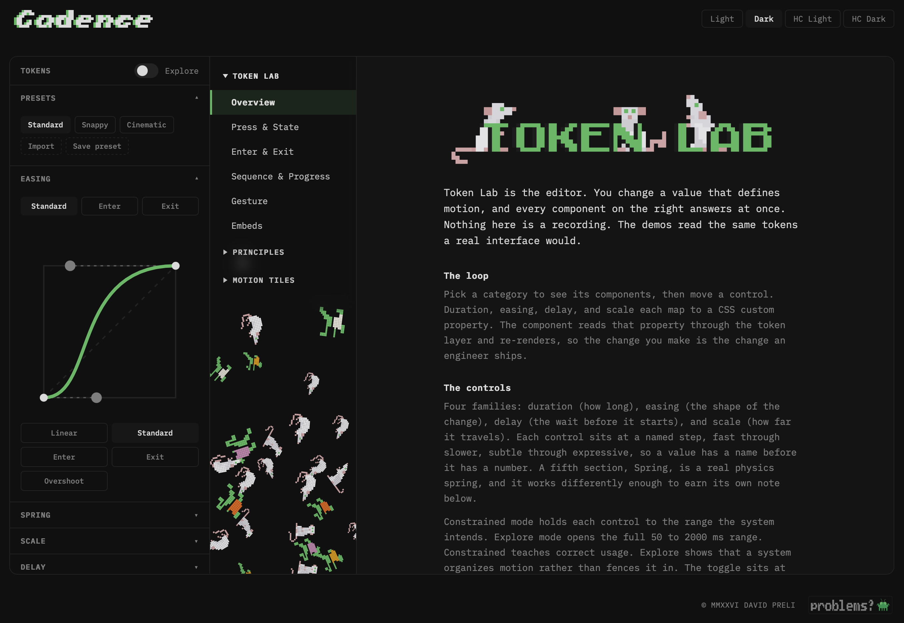
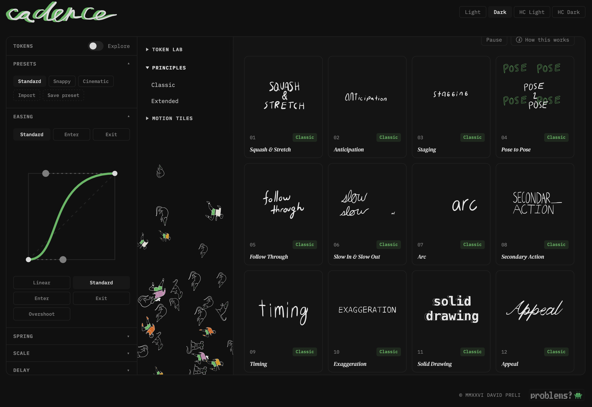
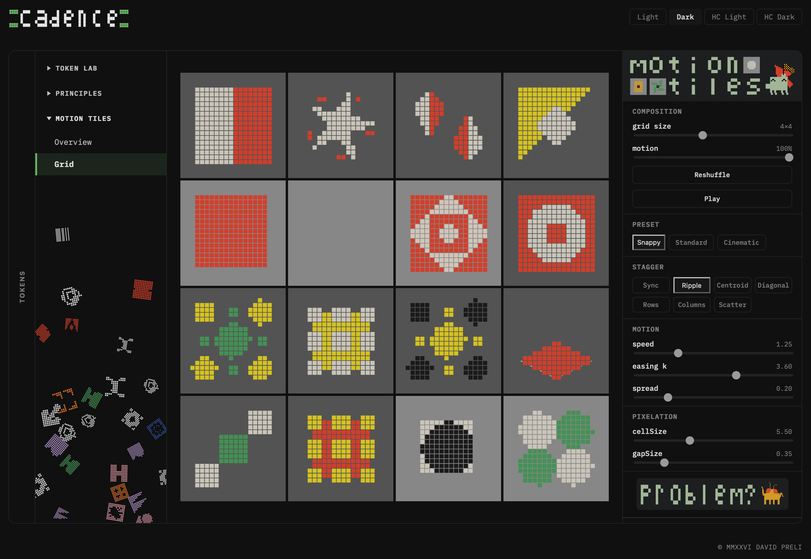

<h1></h1>

## Case Study

<!-- V01: the overview video, delivered 2026-08-05. Vimeo embed in a responsive 16:9 frame;
     Vimeo serves its own poster, so the OG-image placeholder retires. -->

  <iframe src="https://player.vimeo.com/video/1218553606?badge=0&amp;autopause=0&amp;player_id=0&amp;app_id=58479" title="Cadence: the case study overview" allow="autoplay; fullscreen; picture-in-picture; clipboard-write" allowfullscreen style="position: absolute; top: 0; left: 0; width: 100%; height: 100%; border: 0;"></iframe>

---

## Overview

Cadence is a motion design system explorer. It demonstrates how design tokens drive animation behavior in real UI components, through the classic 12 principles of animation and six design-engineering extensions. Three tools share the vocabulary: Token Lab edits the tokens live, the Principles Library teaches them through eighteen cards, and Motion Tiles takes the named presets to field scale. It is built as a curriculum for designers learning how motion works at the system level.

**Role:** Solo. Design, architecture, development, documentation.
**Timeline:** Thirteen weeks to production. First commit April 18, 2026; live July 15, 2026, and still shipping. 285 commits as of August 15.
**Stack:** React, Framer Motion, CSS Custom Properties, Rive, Vite.
**Live:** [cadence.davidpreli.com](https://cadence.davidpreli.com)

<!-- V12: stat row. Values current as of 2026-08-15 (test and decision counts move; the commit
     count lives in the Timeline line above; refresh both on republish). -->

  

    
13

    
WEEKS TO PRODUCTION

  

  

    
39

    
CUSTOM COMPONENTS

  

  

    
578

    
TESTS

  

  

    
39

    
DECISION RECORDS

  

---

## The Problem

Motion in design systems is underdocumented. A design system will specify every color to the hex digit and every spacing step to the pixel, then describe its motion in a paragraph: two duration values, an easing curve named "standard," and a sentence asking for restraint.

I spent eight years on the other side of that paragraph. A motion designer tunes timing in After Effects until it reads right, exports a spec, and hands it across a wall. What comes back rarely moves the way the spec did, and there is no shared surface where both sides can watch a value become a behavior. The relationship between a token and its perceptual result is invisible unless someone builds the thing that makes it visible.

<figure style="margin: 0 0 16px 0;">
  
  <figcaption style="font-size: 12px; color: #909090; margin-top: 8px;">The sentence below, running. The slider ramps 50 to 350; the presses are live.</figcaption>
</figure>
Cadence is that thing. Drag `duration.fast` from 50ms to 350ms and watch a button's press change character in the same second. The argument underneath: the freedom motion designers have in After Effects is not lost when motion enters a design system. It is organized, named, and made legible, and the organizing is a skill motion designers already have.

---

## Goals

1. Build a tool that makes the token-to-behavior relationship visible and interactive
2. Apply the classic 12 principles of animation, plus six design-engineering extensions, to real UI components, not abstract shapes
3. Develop React and design systems fluency through a project with genuine utility
4. Produce a portfolio artifact that demonstrates design engineering thinking

---

## Approach

### Token Architecture

<figure style="margin: 0 0 16px 0;">
  
  <figcaption style="font-size: 12px; color: #909090; margin-top: 8px;">The live code view. Values tick as sliders move; fixed references carry the (fixed) tag.</figcaption>
</figure>
Tokens are CSS custom properties in one file, `src/tokens/motion.css`. Five families: duration (fast 100ms, base 200ms, slow 400ms, slower 600ms), easing (five named cubic-bezier curves), delay (a named zero plus short, medium, long), scale (three press compressions below 1 and a lift above it, renamed `pressSubtle` / `pressBase` / `pressExpressive` / `lift` in July so direction lives in the name and no key implies a neutral it does not have), and spring (stiffness, damping, and mass, unitless, because a real spring is not measured in time). Components never hardcode an animation value; they read tokens at runtime through `getComputedStyle`. The custom-property layer is the one Material and Primer ship; the runtime read is Cadence's addition, and it is what keeps the demonstration authentic rather than simulated: Token Lab edits the same layer a production system would ship.

The set splits into editable tokens and fixed references. The durations, the four easing slots, the delays, the scales, and the spring parameters all have controls, and each control section carries a Constrained / Explore toggle: Constrained keeps the ranges a shipping UI would use, Explore opens the full range. The fourth easing slot, `ease.overshoot`, surfaces its control only in Explore, where the curve graph has the vertical room its above-one handle needs. Two tokens deliberately have no control at all: `ease.linear` is the constant-velocity baseline every curve is measured against, and `delay.none` is the system's named zero. The live code view tags these reads `(fixed)`, and a guard test asserts the two classes partition the full token set with nothing shared and nothing left over. One value stands outside the partition on purpose: the duration scalar, a single editable multiplier (effective duration = base × scalar) that drives the duration-versus-distance plot, handled outside the family machinery as a demonstrative multiplier.

Token sets export in four formats: W3C DTCG (`$type`/`$value`, the shape Style Dictionary and Figma Variables consume), flat JSON mirroring the CSS variable names, a drop-in CSS `:root` block, and a ready-to-use Framer Motion module (`cadence.motion.js`): named exports in seconds and four-number ease arrays, the spring as a native `{ type: 'spring' }` config, and composed transition examples, because the tool that teaches how tokens become motion should export the motion-side artifact, not only the token-side ones. All four serialize from one normalized object so they cannot drift. The spring family posed the one format question, because the DTCG draft has no spring type: it serializes as three `number` leaves under a `motion.spring` group, valid DTCG today with no invented type, and the group name carries the composition a custom type would have added. Import runs the pipeline in reverse with validation: scalars clamp to the Explore bounds and report, missing tokens fill from Standard and report, round-tripped curves re-canonicalize to their named keys, and the report modal lists every correction. One class of value refuses the clamp: a spring stiffness, damping, or mass at zero or below is a spring that never settles, so it fails the import as a structural error instead of being bent into something that looks valid and is not. A tuned token set leaves the tool as the artifact an engineer's pipeline consumes.

### The Hybrid Model: CSS Custom Properties + Framer Motion

<!-- V07: two-channel dispatch diagram. Inline SVG, dark theme baked (values from color.css dark). Labels are coupled to TokenLab/index.jsx names (dispatch, syncToCss, stateToTokens, MotionTokensProvider); if those rename, this diagram follows. Page should load IBM Plex Mono; falls back to system monospace. -->
<svg viewBox="0 0 880 440" role="img" aria-label="The two-channel dispatch: one slider edit updates the CSS custom property and the React context from the same reducer state" style="max-width: 880px; width: 100%; height: auto; font-family: 'IBM Plex Mono', ui-monospace, monospace;">
  <title>The two-channel dispatch</title>
  <defs>
    <marker id="v07-arrow" viewBox="0 0 8 8" refX="7" refY="4" markerWidth="7" markerHeight="7" orient="auto-start-reverse">
      <path d="M0.5 0.5 L7.5 4 L0.5 7.5 Z" fill="#76c17d" />
    </marker>
  </defs>

  <rect x="0.5" y="0.5" width="879" height="439" rx="12" fill="#141414" stroke="#2e2e2e" />

  <text x="40" y="48" font-size="11" font-weight="600" letter-spacing="1.5" fill="#aaaaaa">THE TWO-CHANNEL DISPATCH</text>

  <!-- The edit -->
  <rect x="30" y="174" width="170" height="56" rx="8" fill="#1a1a1a" stroke="#3d3d3d" />
  <text x="115" y="198" font-size="12" fill="#e1e1e1" text-anchor="middle">slider drag</text>
  <text x="115" y="216" font-size="10" fill="#909090" text-anchor="middle">SET_DURATION · fast · 140</text>

  <!-- dispatch -->
  <rect x="240" y="174" width="150" height="56" rx="8" fill="#1a1a1a" stroke="#3d3d3d" />
  <text x="315" y="206" font-size="12" fill="#e1e1e1" text-anchor="middle">dispatch(action)</text>

  <path d="M200 202 H232" stroke="#76c17d" stroke-width="1.5" fill="none" marker-end="url(#v07-arrow)" />

  <!-- Channel 1 · CSS -->
  <text x="450" y="76" font-size="10" font-weight="600" letter-spacing="1" fill="#909090">CHANNEL 1 · CSS</text>
  <rect x="450" y="88" width="170" height="60" rx="8" fill="#1a1a1a" stroke="#3d3d3d" />
  <text x="535" y="122" font-size="12" fill="#e1e1e1" text-anchor="middle">syncToCss(action)</text>
  <rect x="650" y="88" width="190" height="60" rx="8" fill="#1a1a1a" stroke="#3d3d3d" />
  <text x="745" y="112" font-size="11" fill="#e1e1e1" text-anchor="middle">--motion-duration-fast</text>
  <text x="745" y="130" font-size="10" fill="#909090" text-anchor="middle">written on :root</text>
  <text x="450" y="172" font-size="10" fill="#909090">anything reading the document sees the new value</text>

  <!-- Channel 2 · React state -->
  <text x="450" y="246" font-size="10" font-weight="600" letter-spacing="1" fill="#909090">CHANNEL 2 · REACT STATE</text>
  <rect x="450" y="258" width="170" height="60" rx="8" fill="#1a1a1a" stroke="#3d3d3d" />
  <text x="535" y="292" font-size="12" fill="#e1e1e1" text-anchor="middle">reducer state</text>
  <rect x="650" y="258" width="190" height="60" rx="8" fill="#1a1a1a" stroke="#3d3d3d" />
  <text x="745" y="282" font-size="11" fill="#e1e1e1" text-anchor="middle">stateToTokens(state)</text>
  <text x="745" y="300" font-size="10" fill="#909090" text-anchor="middle">→ MotionTokensProvider</text>
  <text x="450" y="342" font-size="10" fill="#909090">demo components take the same values with no CSS read at all</text>

  <!-- The split: one dispatch feeds both channels -->
  <path d="M390 202 H420 V118 H442" stroke="#76c17d" stroke-width="1.5" fill="none" marker-end="url(#v07-arrow)" />
  <path d="M390 202 H420 V288 H442" stroke="#76c17d" stroke-width="1.5" fill="none" marker-end="url(#v07-arrow)" />
  <path d="M620 118 H642" stroke="#76c17d" stroke-width="1.5" fill="none" marker-end="url(#v07-arrow)" />
  <path d="M620 288 H642" stroke="#76c17d" stroke-width="1.5" fill="none" marker-end="url(#v07-arrow)" />

  <!-- The claim -->
  <text x="40" y="394" font-size="13" fill="#e1e1e1">One dispatch, both channels, no divergence:</text>
  <text x="40" y="414" font-size="13" fill="#909090">the context object is derived from the same state that wrote the CSS.</text>
</svg>
CSS owns the values; Framer Motion executes the motion. The trick is keeping both honest while a slider is being dragged.

Token Lab runs a two-channel update. Every change writes the CSS custom property, so anything reading the document root sees the new value. Simultaneously, a React context provider hands the same values directly to components inside the demo area, bypassing the CSS read entirely, so a drag retimes the demos on the same frame instead of waiting for a re-read. Components outside the provider fall back to the CSS channel. One dispatch, both channels, no divergence: the context object is derived from the same state that wrote the CSS.

The system also draws a line the demonstration depends on. Demonstration motion, the thing a principle teaches, reads the editable `--motion-*` tokens, because the point is that editing a token changes it. The tool's own chrome (hover states, the nav crossfade, accordions) reads fixed `--feedback-*` constants instead, so dragging a duration to near zero in Explore mode can never collapse the interface's own feedback into nothing. A build-gating test enforces the whole arrangement: an undocumented inline animation literal in a component fails the suite, and the one literal on its allow list is Token Fidelity's deviant pill, hardcoded because that principle teaches what hardcoding does. The claim "no hardcoded animation values" is not a convention here; it is a test that fails.

<!-- V13: spring glyph inlined from public/titleSVGS/spring.svg, ink set to heading color (the source file is black-on-transparent). -->
<h3 style="display: flex; align-items: center; gap: 12px;"><svg viewBox="0 0 79.34 47.16" width="40" height="24" aria-hidden="true" style="flex: none;"><path fill="#e1e1e1" d="M30.57,41.02c-3.83-7.07-1.6-20.87,2.16-28.4-.81-1.22-1.89-2.26-3.21-3-2.64-1.49-6.04.56-7.93,3.09,3.26,5.56,4.77,12.59,4.37,18.94-.25,3.98-1.64,8.59-5.5,9.7-2.7.78-5.31-.38-6.56-2.89-3.38-6.79-.59-19.06,3.43-25.68-2.5-2.94-6.73-1.62-9.21,1.01-3.22,3.43-4.39,8.76-4.78,13.44-.08.99-.91,1.63-1.78,1.57S-.07,27.96,0,26.95c.4-5.68,2.13-12.28,6.33-16.14,3.59-3.31,9.29-4.52,13.03-.79,1.66-1.82,3.58-3.31,5.96-3.97,3.73-1.04,6.65.53,9.26,3.42,1.94-2.97,4.41-5.25,7.57-6.6,4.4-1.87,9.16-1.02,12.65,2.38,3.52-4.5,8.77-6.63,14.06-4.31,4.84,2.56,7.15,8.75,8.4,14.01,1.4,5.9,1.97,11.84,2.07,17.92.02,1.01-.84,1.7-1.69,1.7-.91,0-1.65-.69-1.67-1.7-.13-5.84-.65-11.54-2-17.21-1.02-4.28-3.18-10.51-7.27-11.95-3.65-1.28-7.31.87-9.56,3.98,5.22,6.96,7.66,16.97,7.66,25.56,0,5.83-1.77,13.7-7.96,13.89-4.28.13-6.84-3.45-8.02-7.54-2.7-9.34-.81-22.82,4.04-31.55-2.67-2.99-6.79-3.66-10.34-1.65-2.47,1.41-4.37,3.55-5.78,6.02,4.23,7.28,7.55,20.78,3.8,27.99-1.29,2.48-3.84,3.94-6.59,3.36-1.5-.32-2.65-1.42-3.39-2.77ZM59.14,42.5c.81-1.07,1.34-2.33,1.63-3.6,1.92-8.31-.61-20.87-5.56-28.09-3.42,6.79-4.56,14.84-4.15,22.19.33,3.37.93,7.57,3.24,9.84,1.4,1.38,3.59,1.32,4.84-.34ZM20.96,37.18c.88-1.46,1.39-2.98,1.56-4.7.57-5.64-.45-11.35-3-16.63-2.57,4.97-3.71,10.25-3.75,15.65.1,1.84.33,3.5.94,5.15.48.84,1.09,1.53,1.93,1.58s1.61-.35,2.31-1.04ZM34.72,40.48c3.05.71,4.13-4.5,4.06-7.81-.1-5.7-1.37-11.21-3.9-16.54-2.7,6.71-4.1,15.93-1.7,22.66.34.6.81,1.52,1.53,1.69Z" /></svg>The Spring That Is Not a Curve</h3>

For the first three months the token set carried an easing curve named `spring`: `(0.34, 1.56, 0.64, 1)`, a cubic-bezier whose control point climbs past 1 and comes back down. It gives the look of a spring on a fixed timeline. A true spring has no duration; you give it stiffness, damping, and mass, and the settle time falls out of those three. The July harmonization pass renamed the bezier to `overshoot`: the name now describes what the curve does, not what it imitates.

The rename freed the name for the real thing. Three unitless custom properties join the token layer, read at runtime like every other token, and Framer Motion consumes them as `{ type: 'spring', stiffness, damping, mass }` instead of a duration plus a curve. Each preset bakes its own spring personality: Snappy is stiff and bounces hard, Cinematic damps the bounce nearly out and arrives composed, Standard settles with a hint of ring. Material 3 Expressive moved its expressive motion to physics springs in 2025; Cadence follows without breaking its own read-at-runtime rule, because unitless numbers get along in CSS custom properties.

<figure style="margin: 0 0 16px 0;">
  
  <figcaption style="font-size: 12px; color: #909090; margin-top: 8px;">The imitation and the physics on one state. Each toggle carries its curve above it; the spring has no duration anywhere.</figcaption>
</figure>
The tool surface makes the difference visible. The Spring section carries three sliders and a settle-curve visualizer: a plot of displacement over time, rising, overshooting the target, settling, redrawn as the sliders move. The math underneath is the damped harmonic oscillator, the same second-order system Framer Motion integrates, kept in a pure module so the three regimes (underdamped rings, critical arrives clean, overdamped crawls) test without React. Switch a Button to Spring, drag stiffness, and the button, the chart, and the dedicated SpringDemo move together off one context.

One gap surfaced on the way and closed. Reduced-motion support here works by flattening durations to near zero, and a spring has no duration to flatten, so the preference slid right past it. The flattened token set now carries a flag the spring consumers read, falling back to the bezier branch whose timing is already collapsed. The principle demo that forced the fix is Follow Through, the first reduced-motion-respecting surface to run the real spring.

### The Principles as UI Curriculum

<!-- V08: live Token Fidelity embed. The iframe serves ExpandedPrincipleBody's third frame
     from the app itself (?embed=token-fidelity&theme=dark); the route is live on production
     (PR #2, 2026-08-15). David's fallback SVG sits behind the iframe as its background:
     visible while the document loads and when it cannot. -->

  

    
Every principle is demonstrated twice: a Rive illustration on the animation side, and a real UI component driven by the live token system on the other. The pairing is the pedagogy. A motion designer already knows what anticipation looks like; what Cadence shows is where anticipation lives in an interface (a drawer that lifts before it leaves) and which tokens produce it (<code>ease.exit</code> at <code>duration.slow</code>, with keyframes carrying the countermotion).

    
Real components were chosen over abstract shapes because abstraction is the problem being solved. A bouncing ball demonstrates easing; it does not demonstrate why a dropdown's chevron should share its menu's timing. The demos borrow Token Lab's own Button, Drawer, Modal, and Carousel, so a principle learned in one tool is recognizable in the other, and every demo responds when a token changes.

    
The six extensions are the original contribution. The classic 12 teach how motion reads; the extensions teach how motion scales: Systematization, Hierarchy of Motion, Economy, Token Fidelity, Reduced Motion, and Shared Vocabulary. They are the principles I needed when I moved from animating one thing well to making motion consistent across a system.

  

  <figure class="v08-figure">
    <iframe src="https://cadence.davidpreli.com/?embed=token-fidelity&theme=dark" width="462" height="522" loading="lazy" title="Token Fidelity, live from Cadence"></iframe>
    <figcaption class="v08-caption">Live from the tool: Token Fidelity, principle 16. Everything in the panel runs here, the Motion/UI toggle, the deviant pill, the Harmonize repair.</figcaption>
  </figure>

### Motion Tiles: One Vocabulary at Scale

<figure style="margin: 0 0 16px 0;">
  
  <figcaption style="font-size: 12px; color: #909090; margin-top: 8px;">A preset change crossing the grid; the stagger carries it as a wave.</figcaption>
</figure>
The third tool answers the question the first two raise: what happens when a motion vocabulary has to cover a field instead of a button? Motion Tiles is a pooled mosaic of over fifty Rive tiles sharing one clock. Change a preset and every tile recolors and retimes together. Drag the stagger and the change crosses the grid in a wave.

The presets are the same three personalities Token Lab carries, Snappy, Standard, Cinematic, spoken in a different dialect. A button press wants a duration and a bezier. An ambient field wants a period, an envelope, a spread. The two control suites stay separate on purpose: the user works one tool bar at a time, and the values were tuned to their contexts (a field that slows the way Cinematic slows a button would put the room to sleep). What the system shares across motion classes is the names; what it scopes per class is the interpretation. A vocabulary is only usable if you also decide where it ends.

The architecture is the argument made physical. The tiles carry no clocks of their own: one React `requestAnimationFrame` loop computes each tile's phase-offset progress from a weight table and writes it into that tile's Rive view model every frame. Speed, easing, and stagger are consumed in React, not in the assets, which is exactly the token-to-behavior relationship from Token Lab operating on fifty canvases at once. The section is landing-gated so its WebGL2 grid loads only when entered, and the per-tile Rive bindings were built with Claude Code driving the Rive editor over MCP, a workflow the landing page walks through.

### Embeds: Tokens Across the Canvas Boundary

Token Lab's component demos read tokens into Framer Motion props, which is the easy case: everything speaks CSS. The Embeds category runs the same tokens into canvases that have never heard of CSS, and the two demos split the ownership of time between them.

<!-- V09: live Rive Clock embed (?embed=rive-clock&theme=dark). Canvas only; a ghost pointer
     tours the quadrants and yields to a real pointer. Live on production (PR #2, 2026-08-15).
     David's fallback SVG sits behind the iframe as its background. -->
<figure style="float: right; width: 340px; max-width: 100%; margin: 0 0 16px 24px;">
  <iframe src="https://cadence.davidpreli.com/?embed=rive-clock&theme=dark" width="340" height="425" loading="lazy" title="Rive Clock, live from Cadence" style="border: 0; display: block; background: url(hosted/media/riveClockFallback.svg) center / contain no-repeat;"></iframe>
  <figcaption style="font-size: 12px; color: #909090; margin-top: 8px;">Live: the Rive Clock. The color plates chase a cursor on token timing; when nobody is there, a ghost takes the tour. Reach in and it yields. A click waters the plant.</figcaption>
</figure>
React Clock is a Rive animation triggered by a DOM button. The file holds poses; React holds time. Every animation in the `.riv` is a linear timeline scrubbed by a view-model number from 0 to 1, and a `requestAnimationFrame` driver integrates the live tokens into eased progress each frame: rain rides `duration.fast`, growth `duration.slower` on `ease.enter`, flowers arrive on `slow` and `standard` after `delay.long`. No duration, speed, or easing property exists inside the file at all, so a slider drag mid-growth bends the plant's pace on the very next frame. The Rive authoring and the React driver were built on opposite sides of a wall neither tool can see over, against a committed contract document naming every property, its type, and who writes it; when the two sides disagreed about what a number meant, the contract, not the code, was where the argument settled.

Rive Clock inverts the ownership. The animation is an interactive state machine that keeps its own clock (click it and it waters), rendered invisible; a WebGL shader stacked on top paints the pixelated copy the user actually sees, split into three color plates that chase the cursor. The tokens drive the chase: `duration.base` is the follow time constant, `duration.slow` the homecoming when the pointer leaves, `ease.standard` its curve, `delay.short` the per-plate stagger, `scale.pressExpressive` the aberration amplitude. Block size and gap stay spatial controls with no token behind them, because Token Fidelity keeps time-domain tokens on time-domain jobs. One demo where React owns the clock, one where the file does, and the same token set reaches into both.

### The Background: A Generative Field on the Token Clock

<figure style="margin: 0 0 16px 0;">
  
  <figcaption style="font-size: 12px; color: #909090; margin-top: 8px;">Two themes, one field. The placements hold still; only the paint changes.</figcaption>
</figure>
The nav column carries an ambient background: a field of small hand-authored animal marks, six rats and four runners per library, placed by a generative composition, swaying on a slow two-sine wander, revealed as a section opens. Each of the three sections has its own mark library (hand-drawn for the Principles, pixel exports for Token Lab and Motion Tiles), and each library is authored in four colorways, one per theme, so the art is themed at the source instead of recolored at runtime.

Two architecture rules shape it. First, a theme switch must never regenerate the field: geometry and placement hold still while only the paint changes, and the shipped build was verified holding every placement byte-identical across a switch. Second, the unit of loading is one file: one library, chosen by the open section, in one colorway, chosen by the theme. Before that rule, all twelve colorway files shipped eagerly and the background chunk weighed 495.71 kB gzipped, two and a half times the entire app; after it, the landing page fetches 12.75 kB. The parity check that guards the twelve files against drifting apart moved out of the runtime and into the test suite, because the day an export goes out of step the build should fail, not a console line appear in a browser nobody has open.

The rendering is a stamp, not a stroke. The first face flattened every shape to a polyline and outlined it with a 1.3px pen, which reads as drawing on hand-drawn line work and as mud on pixel art, where the pen was 82% as wide as the cells it outlined. The shipped face places each authored mark in `<defs>` once and stamps it with a `<use>` per placement: no flattening, no outlining, no runtime color resolution, because the theme's own file already says what color everything is. The argument for it is that the drawing comes out right.

And the tokens reach it, on the tokens' own terms. The idle drift's period scales with `duration.slower` under a clamp of 2.5 to 12 seconds: Snappy wanders at 2.8s, Standard at 4.8s (exactly the old fixed chrome constant), Cinematic at 11.2s, and Explore's extremes land on the clamp instead of a strobe. Loading a preset or resetting to defaults replays the reveal through a counter named `revealKey`; a slider drag never does. Named, deliberate acts reach the background, and noise does not. The field also cost the nav its old label color: measured against every ink the face actually draws, the idle labels moved to a new role, `--color-text-nav`, the one text color in the system chosen by what sits behind it rather than by where it sits in the hierarchy.

---

## Principles Library: Build Notes

### The Classic 12

#### 01. Squash and Stretch
**UI Component:** Button (the same one from Token Lab's Press & State demo)
**Token values driving it:** `scale.pressBase`, `duration.fast`, `ease.standard`, `ease.overshoot`
**Key decision:** One scale value carries both halves of the principle; the split lives in the easing, `ease.standard` down and `ease.overshoot` back. And reuse the component the user has already met rather than build a demo prop, so the principle attaches to something they have pressed before.
**What it demonstrates:** Weight. The press compresses, the release overshoots past rest before settling, and the travel is a few percent of scale doing the whole job.

#### 02. Anticipation
**UI Component:** Drawer (scoped, from Enter & Exit)
**Token values driving it:** `duration.slow`, `ease.enter`, `ease.exit`
**Key decision:** Enter and exit share one duration; the character splits in the easing and the keyframe spacing, and the countermotion lives on the exit, a lift in the first fifth of the clock before the drop.
**What it demonstrates:** An action that is caused rather than one that merely happens. The drawer states its intent before it leaves.

#### 03. Staging
**UI Component:** Modal with backdrop
**Token values driving it:** `duration.slow`, `ease.enter`
**Key decision:** The backdrop is the demonstration, not the panel. Staging is the darkening as much as the lighting.
**What it demonstrates:** Clearing the stage. The dim removes everywhere else the eye could land.

#### 04. Straight Ahead and Pose to Pose
**UI Component:** Compact Stepper above a ProgressBar, one shared `step` counter
**Token values driving it:** `duration.base`, `ease.standard`, `delay.short/medium/long`, `duration.slow`
**Key decision:** Drive both components from a single counter so "two approaches to the same motion" is literal: one advance, one discrete visualization, one continuous.
**What it demonstrates:** The designer controls the poses; the system controls the in-betweens. UI animation is pose to pose almost by definition.

#### 05. Follow Through and Overlapping Action
**UI Component:** Carousel (compact, text-only) with its dot indicator
**Token values driving it:** `spring.stiffness`, `spring.damping`, `spring.mass`: the snap runs the real physics spring, with the flattened bezier branch as the reduced-motion fallback
**Key decision:** The dot's width animates on the same transition object as the slide, so the follow-through is a property of the system, not a choreographed lag. The dot spent months on a CSS transition to stay clear of the projection system; it returned to Framer Motion as direct value animation, which never touches projection, once the original hazard was named precisely enough to know what was safe. (See Key Decisions.)
**What it demonstrates:** Settling as physics. The slide overshoots and rings down, the dot rides the same spring, and nothing here has a duration.

#### 06. Slow In and Slow Out
**UI Component:** ProgressBar with a Tokens / Linear toggle
**Token values driving it:** `ease.standard` vs `ease.linear`, `duration.slow`
**Key decision:** Same duration on both settings, so the only variable is the curve. When the toggle returns to Tokens, the controls panel's title flashes once, drawing the thread to where the value lives.
**What it demonstrates:** Identical timing, different curve, categorically different character. Linear motion belongs to machines.

#### 07. Arc
**UI Component:** Tooltip
**Token values driving it:** `duration.base`, `ease.enter`
**Key decision:** Three keyframes, not two. Two keyframes ease the speed but leave the path a straight line; the third bends the trajectory, and the bend is the principle.
**What it demonstrates:** A tooltip that rises straight up reads as a notification. One that arcs in reads as an answer arriving from somewhere.

#### 08. Secondary Action
**UI Component:** Dropdown with rotating chevron
**Token values driving it:** `duration.fast`, `ease.standard`, shared by menu and chevron
**Key decision:** One timing for both motions so they read as a single gesture. The chevron carries no information the menu does not; confirmation is its entire job.
**What it demonstrates:** Subordination. The moment a secondary action pulls the eye from the thing it supports, it has become noise.

#### 09. Timing
**UI Component:** Two Toggles, each scoped to a different preset via `MotionTokensProvider`
**Token values driving it:** `duration.fast/base/slow` compared across presets
**Key decision:** The real presets differ by only 100ms on the token the Toggle animates, too small to read in one flip, so the demo slows the Cinematic slot by a fixed, demo-scoped factor. The amplification is honest and documented; the preset keeps its true values everywhere else.
**What it demonstrates:** Duration alone changes personality. No easing difference, no path difference, and one Toggle feels decisive while the other feels considered.

#### 10. Exaggeration
**UI Component:** NotificationBadge with New / Clear triggers
**Token values driving it:** `scale.pressExpressive`, `ease.overshoot`, `duration.slow`
**Key decision:** Re-key the badge on every increment so the enter animation fires each time; the compress comes from the initial scale and the overshoot from the bezier, two motion sources composing one alert.
**What it demonstrates:** A badge that scales to exactly 1.0 registers as a state change. The overshoot is what turns it into an alert.

#### 11. Solid Drawing
**UI Component:** Card, centered with room around it
**Token values driving it:** `scale.lift`, `duration.base`, `ease.standard`
**Key decision:** Sixteen pixels of margin on every side so the 2% lift reads against empty space instead of against neighbors.
**What it demonstrates:** The implied z-axis. The selected card is not highlighted; it has come forward, and the surface it was embedded in is now behind it.

#### 12. Appeal
**UI Component:** A 2x2 grid of compact Cards with ASCII faces
**Token values driving it:** All of them: `duration.slower` drives an ambient drift, `duration.base` the settle, `ease.standard` the neutral states, `ease.overshoot` the selection
**Key decision:** Per-card phase offsets on the idle drift so the four never sync. Selection freezes the drift, dims the siblings, lifts the chosen card.
**What it demonstrates:** Appeal is the other principles working in concert. Nothing here is remarkable alone; nothing is wrong.

### The Extended 6

#### 13. Systematization
**UI Component:** A Tempo slider over a Toggle, compact Card, and ProgressBar
**Token values driving it:** The whole duration family, scaled proportionally by the slider
**Key decision:** Scale durations only. Delays stay proportional and easing stays untouched, because the principle is temporal coherence, not curve shape.
**What it demonstrates:** One slider moves and every component responds at its own native speed. The system has one voice.

#### 14. Hierarchy of Motion
**UI Component:** A PARENT pill above three indented CHILD rows, drawn as a tree
**Token values driving it:** `duration.base`, `ease.standard`, `delay.short/medium/long`
**Key decision:** The children are not interactive. Only the parent can initiate motion, so the demo's interaction model enforces the principle it teaches.
**What it demonstrates:** Authority flows downward, and the cascading delays are the hierarchy made visible.

#### 15. Economy
**UI Component:** Three horizontal bars with a Pan trigger
**Token values driving it:** `duration.slow/base/fast`, `ease.standard`, one per bar
**Key decision:** Depth from three opacity levels and three speeds, no shadows, no stacking order. Three layers of parallax suggest a world; thirty just suggest thirty.
**What it demonstrates:** The smallest set of moves that produces the intended depth. Every motion element earns its place.

#### 16. Token Fidelity
**UI Component:** Three identical pills, one deviant
**Token values driving it:** `duration.base` and `ease.standard` on two pills; a hardcoded 600ms linear on the third, and a Harmonize toggle that repairs it
**Key decision:** Make the wrongness perceptual before it is explained. The deviant pill arrives late at constant velocity and reads as mechanical before the viewer knows why.
**What it demonstrates:** A hardcoded value is not a shortcut; it is visible damage.

#### 17. Reduced Motion
**UI Component:** A Reduce toggle over a Run button, ProgressBar, and Card
**Token values driving it:** All of them, conditionally: durations flatten to 0.01s, delays to zero; easing and scale stay, since they are not perceived at near-zero duration
**Key decision:** The demo's toggle is the single source of truth inside its scope, so both states are visible regardless of the viewer's OS setting. The support underneath is real: `prefers-reduced-motion` is wired through the entire codebase, not simulated in one card.
**What it demonstrates:** Reduced motion as a first-class state. The interface communicates the same information without requiring the user to process movement.

#### 18. Shared Vocabulary
**UI Component:** Two tracks, two dots, one curve
**Token values driving it:** The named presets themselves; the demo pins canonical curve values so the binding between name and numbers stays fixed
**Key decision:** Label one track "Snappy" and the other "0.34, 1.56, 0.64, 1" and let them run identically. The comparison is the whole demo.
**What it demonstrates:** Motion values that cannot be named cannot be systematized. The name carries the intention the numbers cannot, and a named preset is the minimum unit of design-engineering communication.

---

## Key Decisions

**CSS custom properties as the token layer, Framer Motion as the execution layer.** The alternative was a JavaScript theme object, simpler to wire and invisible to the platform. Custom properties won because they are what production systems ship: the browser owns the values, CSS transitions can read them directly, and Token Lab's edits go through the same layer an engineer's build would. The cost is a parsing seam (values arrive as strings, in whatever format a build tool wrote), and that seam eventually produced the best bug in the project. See the last entry.

**A two-channel update system instead of one.** A custom-property write is invisible to React, so components would not retime until something else re-rendered them; updating only React state leaves the CSS layer stale. Token Lab dispatches once and updates both: the custom property for anything that reads the document, and a context override that hands demo components the same values with no read at all. The channels cannot diverge because both derive from one reducer state.

**Chrome timing is not demonstration timing.** Explore mode lets a user drag durations to 50ms or 2000ms, which is the point of the tool and a denial-of-service attack on its own interface. The resolution is two classes of motion: demonstrations read the editable `--motion-*` tokens; the tool's own feedback reads fixed `--feedback-*` constants. A test gate fails the build on any undocumented inline animation literal in components, so the boundary is enforced, not remembered. The boundary has exactly one argued crossing: the background field's drift period scales with `duration.slower` under a 2.5-to-12-second clamp, so a preset change reaches the ambient chrome while Explore's extremes never can. The chrome rule was written against unbounded input, not against input, and the clamp is its honest reading rather than a way around it.

<!-- V11: grid evolution strip. Inline SVG, dark theme baked, same style language as V07.
     Content mirrors the paragraph below; if the grid history prose changes, this follows. -->
<svg viewBox="0 0 880 260" role="img" aria-label="The principle grid's five states: flexbox with JS widths, 1fr rows, minmax rows, flat rows, and the shipped fixed columns, each labeled with the failure that ended it" style="max-width: 880px; width: 100%; height: auto; font-family: 'IBM Plex Mono', ui-monospace, monospace;">
  <title>The grid, five states</title>
  <defs>
    <marker id="v11-arrow" viewBox="0 0 8 8" refX="7" refY="4" markerWidth="6" markerHeight="6" orient="auto"><path d="M0.5 0.5 L7.5 4 L0.5 7.5 Z" fill="#909090" /></marker>
  </defs>
  <text x="40" y="44" font-size="11" font-weight="600" letter-spacing="1.5" fill="#aaaaaa">THE GRID · FIVE STATES</text>
  <text x="110" y="78" font-size="11" fill="#e1e1e1" text-anchor="middle">flexbox + JS widths</text>
  <rect x="50" y="92" width="120" height="110" rx="6" fill="#1a1a1a" stroke="#3d3d3d" />
  <rect x="58" y="104" width="40" height="18" rx="2" fill="#262626" />
  <rect x="102" y="104" width="24" height="18" rx="2" fill="#262626" />
  <rect x="130" y="104" width="32" height="18" rx="2" fill="#262626" />
  <rect x="58" y="128" width="26" height="18" rx="2" fill="#262626" />
  <rect x="88" y="128" width="48" height="18" rx="2" fill="#262626" />
  <rect x="140" y="128" width="22" height="18" rx="2" fill="#262626" />
  <text x="110" y="224" font-size="10" fill="#909090" text-anchor="middle">hundreds of lines of JS</text>
  <text x="110" y="240" font-size="10" fill="#909090" text-anchor="middle">doing CSS Grid's job</text>
  <text x="275" y="78" font-size="11" fill="#e1e1e1" text-anchor="middle">1fr rows</text>
  <rect x="215" y="92" width="120" height="110" rx="6" fill="#1a1a1a" stroke="#3d3d3d" />
  <rect x="223" y="104" width="104" height="84" rx="4" fill="none" stroke="#3d3d3d" />
  <rect x="226" y="110" width="30" height="6" rx="2" fill="#262626" />
  <rect x="260" y="110" width="30" height="6" rx="2" fill="#262626" />
  <rect x="294" y="110" width="30" height="6" rx="2" fill="#262626" />
  <rect x="226" y="120" width="30" height="6" rx="2" fill="#262626" />
  <rect x="260" y="120" width="30" height="6" rx="2" fill="#262626" />
  <rect x="294" y="120" width="30" height="6" rx="2" fill="#262626" />
  <rect x="226" y="130" width="30" height="6" rx="2" fill="#262626" />
  <rect x="260" y="130" width="30" height="6" rx="2" fill="#262626" />
  <rect x="294" y="130" width="30" height="6" rx="2" fill="#262626" />
  <text x="275" y="224" font-size="10" fill="#909090" text-anchor="middle">rows collapse inside</text>
  <text x="275" y="240" font-size="10" fill="#909090" text-anchor="middle">a scroll container</text>
  <text x="440" y="78" font-size="11" fill="#e1e1e1" text-anchor="middle">minmax(234px, auto)</text>
  <rect x="380" y="92" width="120" height="110" rx="6" fill="#1a1a1a" stroke="#3d3d3d" />
  <rect x="388" y="104" width="32" height="26" rx="2" fill="#262626" />
  <rect x="424" y="104" width="32" height="26" rx="2" fill="#262626" />
  <rect x="460" y="104" width="32" height="26" rx="2" fill="#262626" />
  <rect x="388" y="134" width="32" height="26" rx="2" fill="#262626" />
  <rect x="424" y="134" width="32" height="26" rx="2" fill="#262626" />
  <rect x="460" y="134" width="32" height="26" rx="2" fill="#262626" />
  <rect x="424" y="104" width="32" height="44" rx="2" fill="#262626" stroke="#909090" />
  <text x="440" y="224" font-size="10" fill="#909090" text-anchor="middle">overshoot against a</text>
  <text x="440" y="240" font-size="10" fill="#909090" text-anchor="middle">moving target</text>
  <text x="605" y="78" font-size="11" fill="#e1e1e1" text-anchor="middle">flat 234px rows</text>
  <rect x="545" y="92" width="120" height="110" rx="6" fill="#1a1a1a" stroke="#3d3d3d" />
  <rect x="553" y="104" width="32" height="26" rx="2" fill="#262626" />
  <rect x="589" y="104" width="32" height="26" rx="2" fill="#262626" />
  <rect x="625" y="104" width="32" height="26" rx="2" fill="#262626" />
  <rect x="553" y="134" width="32" height="26" rx="2" fill="#262626" />
  <rect x="589" y="134" width="32" height="26" rx="2" fill="#262626" />
  <rect x="625" y="134" width="32" height="26" rx="2" fill="#262626" />
  <circle cx="569" cy="117" r="7" fill="none" stroke="#909090" />
  <circle cx="605" cy="117" r="7" fill="none" stroke="#909090" />
  <circle cx="641" cy="117" r="7" fill="none" stroke="#909090" />
  <circle cx="569" cy="147" r="7" fill="none" stroke="#909090" />
  <ellipse cx="605" cy="147" rx="13" ry="4" fill="none" stroke="#909090" />
  <circle cx="641" cy="147" r="7" fill="none" stroke="#909090" />
  <text x="605" y="224" font-size="10" fill="#909090" text-anchor="middle">icons deform under</text>
  <text x="605" y="240" font-size="10" fill="#909090" text-anchor="middle">flex growth</text>
  <text x="770" y="78" font-size="11" fill="#e1e1e1" text-anchor="middle">fixed 180px columns</text>
  <rect x="710" y="92" width="120" height="110" rx="6" fill="#1a1a1a" stroke="#3d3d3d" />
  <rect x="718" y="104" width="64" height="52" rx="3" fill="#1a1a1a" stroke="#76c17d" />
  <rect x="786" y="104" width="30" height="24" rx="2" fill="#262626" />
  <rect x="786" y="132" width="30" height="24" rx="2" fill="#262626" />
  <rect x="752" y="160" width="30" height="24" rx="2" fill="#262626" />
  <rect x="786" y="160" width="30" height="24" rx="2" fill="#262626" />
  <rect x="818" y="104" width="4" height="80" fill="#2e2e2e" />
  <text x="770" y="224" font-size="10" fill="#76c17d" text-anchor="middle">holds.</text>
  <text x="770" y="240" font-size="10" fill="#909090" text-anchor="middle">scrollbar-gutter: stable</text>
  <path d="M184 147 H194" stroke="#909090" stroke-width="1.5" fill="none" marker-end="url(#v11-arrow)" />
  <path d="M349 147 H359" stroke="#909090" stroke-width="1.5" fill="none" marker-end="url(#v11-arrow)" />
  <path d="M514 147 H524" stroke="#909090" stroke-width="1.5" fill="none" marker-end="url(#v11-arrow)" />
  <path d="M679 147 H689" stroke="#909090" stroke-width="1.5" fill="none" marker-end="url(#v11-arrow)" />
</svg>
**The grid earned its architecture five times.** The principle grid's spec sounds trivial: cards in a grid, one expands to 2x2, neighbors reflow. The implementation went through five states, each fixing the failure the previous one revealed: flexbox with runtime width measurement (hundreds of lines of JS doing what CSS Grid does natively), `1fr` rows (collapse inside a scroll container), `minmax(234px, auto)` rows (animation overshoot against a moving target), flat 234px rows (icon deformation from flex growth), and finally fixed 180px columns with `scrollbar-gutter: stable`, because an expanding card summons a scrollbar, and the scrollbar recounts the auto-fit columns mid-animation. `grid-auto-flow: row` stayed over `dense` on an editorial judgment: the empty cells that appear when an expansion does not align with column boundaries are honest. They are the system making room.

**`layoutId` was removed from the codebase entirely.** It is Framer Motion's marquee feature and the obvious tool for indicator pills and card expansion, and every use was taken out. The diagnosis: motion elements register in a global ProjectionNode tree, and a `layoutId` spring keeps snapshotting layout for the whole of its settle, long after the motion reads as finished. A component mounting mid-snapshot can have its enter animation interrupted and freeze at opacity 0 until reload. The Carousel dot moved to a CSS transition, fully outside the projection system; the Toggle thumb to a direct `x` animation; the card expansion to the plain `layout` prop. The dot's story has a second act. When the physics spring arrived, the dot needed to animate in Framer Motion again to share the snap's spring config, and the diagnosis held up under the pressure: the hazard was always FLIP, never animation as such, so the dot returned as a direct width animation, which writes a style value each frame and never touches projection.

**Motion Tiles runs on one clock.** The first architecture gave each tile its own Luau driver script inside the Rive asset. At 36 tiles the frame rate sat near 40fps, and the instinct is to blame the tile count. Measurement said otherwise: 36 instances of the densest tile with no drivers held 60fps, so the per-instance script execution was the cost, not the instances. The shipped design inverts control: assets carry geometry and bindings only, and one React rAF loop writes every tile's progress each frame, with the stagger applied in JS before the write. An unplanned property emerged: the stagger smooths load, because staggered tiles never hit their expensive frames simultaneously.

**The spring shipped as a toggle, not a rewrite.** The obvious first consumer for the physics spring was the Button release, and it was off the table: that motion had been set, feel-checked, and recorded across five layers of documentation days earlier, and shipped feel does not change as a side effect of a token pass. So the spring got its own demo, and five components (Button, Card, Toggle, Carousel, Drawer) took an opt-in `motionMode` prop defaulting to the bezier, surfaced as a coil toggle in each demo's label row. Nothing shipped moving differently. The toggle puts the imitation and the physics on the same component one press apart, and the Drawer makes the cleanest case: its entrance was a keyframe overshoot, a spring faked by hand, and in spring mode the keyframes collapse to a single target the spring overshoots on its own.

**An interactive Rive machine cannot take a theme rebind.** Rive theming here follows a convention: four color instances baked in the file, and a theme switch rebinds to the matching one. Rive Clock broke it. The plant's watered state lives in a data-bound property, a rebind re-applies the new instance's baked value for it, and the state machine cannot distinguish that write from a click: switching themes watered the plant. A keyed remount dodged the rebind by resetting the machine, throwing away the pose. Replaying state across the rebind required naming the exact property the machine transitions on, a guess you lose. The fix that holds binds one instance for the component's life and changes themes by writing the target palette into it; a property is written only if its baked value varies across the four instances, which separates palette from state without naming a single state property. The rule that fell out is now on record: baked-instance rebinding is for art that only watches. A machine that listens gets its colors written.

**The deep link is a guest entrance, not a second front door.** In-grid expansion had held a reserved URL since June, and the obvious build was to give the expanded card one: paste a link, the grid opens that card in place. It shipped as the opposite. A direct link mounts the grid untouched and floats the principle in a modal above it, because in-grid expansion earns its meaning from the neighbors sliding and a cell going empty, the system making room, and reconstructing that during a lazy mount reconstructs a performance nobody is there to watch. So the two doors open differently: residents expand a card and the grid rearranges; guests arrive at a modal and the grid behind it waits. The URL carries a slug that reads like language and the state carries a number, with one function translating between them, so a bad link fails soft to the plain grid and a mismatched filter resolves in the principle's favor. Closing rewrites the hash in place, through `replaceState`, so the back button cannot reopen what was just dismissed. The expanded card's body was lifted into one component that serves both doors, its state left where each caller already reset it, so the card that had been tuned for months did not move a pixel.

**The two-face rendering contract was deleted the day it carried one thing.** The background was built with two rendering faces off one display list, traced outlines and pixel aggregation, held in agreement by an ink-resolution contract: a census, an ink-keyed palette, a runtime color transform. When the native face shipped, reading each colorway's authored fills directly, the contract had nothing left to reconcile, and about 1,500 lines went: both old faces, the census, the palette, the flattener, and the in-page tuning lab. The lab earned its deletion twice over, because a panel seeded from its own copy of the settled values had made the committed default invisible: the flag alone had been shipping the wrong face for days and every check had looked through the panel's override. The cost is named in the record rather than hidden: the two-face contract was the part of the system that read as design engineering rather than decoration, its reasoning stays in the decision docs, and its code stays in git. Nothing about the drawing was lost, because the drawing was always the native face.

**The dev server lies; the built output tells the truth.** In production, opening any Modal blanked the entire page. The dev server was clean. The chain: the CSS minifier rewrites `400ms` as `.4s`, a token parser assumed the authored spelling and returned `NaN`, the `NaN` reached the Web Animations API and threw, and with no error boundary the whole tree unmounted. The fix was three layers deep: format-tolerant parsers extracted into a tested module (28 tests), an ErrorBoundary at the app root so one component's failure is no longer total, and a standing rule in the project's instructions that every session's verification exercises built output, not just `npm run dev`. The bug cost an evening. The rule it produced has already paid for it.

Twenty-plus further decisions, each with its reasoning and rejected alternatives, live in [`docs/decisions/`](https://github.com/StudioDavidPreli/cadence/tree/main/docs/decisions). The eleven-day debugging stretch that produced zero commits and the process discipline that ended it is its own record: [`cadence-animation-chronology.md`](cadence-animation-chronology.md).

---

## What I Built

  <figure style="flex: 1 1 220px; min-width: 200px; margin: 0;">
    
    <figcaption style="font-size: 12px; color: #909090; margin-top: 8px;">Token Lab</figcaption>
  </figure>
  <figure style="flex: 1 1 220px; min-width: 200px; margin: 0;">
    
    <figcaption style="font-size: 12px; color: #909090; margin-top: 8px;">Principles Library</figcaption>
  </figure>
  <figure style="flex: 1 1 220px; min-width: 200px; margin: 0;">
    
    <figcaption style="font-size: 12px; color: #909090; margin-top: 8px;">Motion Tiles</figcaption>
  </figure>

Three tools sharing one token layer, live at [cadence.davidpreli.com](https://cadence.davidpreli.com).

**Token Lab** is a live editor for the motion token set: four duration sliders with a scalar-driven duration-versus-distance plot, four editable easing slots with a draggable bezier visualizer, delays, scales, and the physics spring, whose settle-curve chart redraws the damped oscillator as its three sliders move. Every control updates consuming components in real time through the two-channel system, and the toolbar's own text runs on a named set of chrome type roles defined in one place. A Constrained / Explore toggle per section switches between semantically bounded ranges and the full range. Presets (Standard, Snappy, Cinematic) swap whole motion personalities; user presets persist to localStorage; token sets export as DTCG, flat JSON, a CSS `:root` block, or a ready-to-use Framer Motion module, and import back with a validating report. Five demos carry a coil toggle that swaps their bezier for the real spring in place, and an Embeds category runs the tokens into two canvases: a Rive plant timed by a React clock, and a shader-pixelated plant whose color plates chase the cursor on token timing. A live code view shows the actual Framer Motion calls with current values ticking in the comments.

**The Principles Library** is an 18-card grid, the classic 12 plus the extended 6. Each card expands to a 2x2 footprint. Inside: a Rive illustration of the principle on one side and a live, token-driven UI demo on the other, with a Motion/UI toggle, a sourced quote, a pill naming exactly which tokens drive the demo, and a copy-link control that hands the principle's URL to the clipboard. All 18 demos respond to Token Lab edits.

**Motion Tiles** is the vocabulary at scale: a pooled mosaic of 50-plus Rive tiles driven by one React clock, with presets, stagger patterns, an adjustable grid, and a reshuffle. Plus one easter egg reachable through the logo.

Underneath: 39 custom React components and zero from a UI library. A generative background field in the nav column, its mark libraries loaded per section and painted per theme, drifting on the token clock. Four themes (light, dark, and two high-contrast variants), WCAG AA verified from computed luminance, not by eye. Reduced motion wired globally as a first-class state. Hash routing with deep links, including per-principle links that open as a spotlight modal over the grid. A bug-report pipeline from an in-app Rive button through a Cloudflare Worker to a GitHub issue. 578 tests (518 unit, 60 end-to-end against built output), including the gate that fails the build on hardcoded animation values. Deployed as a Cloudflare Worker with the Rive WASM runtime pinned to the site's own origin.

---

## What I Learned

React stopped being a syntax problem the day the two-channel system made sense. Context is for ambient data many unrelated components need; props configure a specific instance; and a Context default of `null` with a thrown error beats a fallback object, because a fallback that silently does nothing is a bug you find weeks later. Fail fast was a phrase I knew from the lab bench. It turned out to mean the same thing here.

The idiomatic-first rule held every time I doubted it. Start with `useState`, with the plain read, with the pattern the documentation suggests, and optimize only when something measurable hurts. The one place I inverted this (assuming the tile count was Motion Tiles' performance cost, when measurement showed it was the per-tile scripts) cost a week of building toward the wrong fix.

Animation libraries have architecture, and it can bite. Framer Motion's projection tree is global; `layoutId` can corrupt animations three components away; and the fix that survives is sometimes the boring one, a CSS transition, chosen because it is outside the system rather than in spite of that. When the spring work later needed that dot animating in Framer Motion again, the diagnosis was precise enough to permit it: the hazard was the projection system, not animation, so the dot came back as a direct value animation and nothing broke. Debugging this without commits for eleven days taught me more about process than about Framer Motion: small commits, one hypothesis at a time, write down what was ruled out.

The dev server is not the product. The minifier rewrote a token format, a parser trusted the authored spelling, and production blanked while `npm run dev` stayed green. What I would do differently from day one: the error boundary before the first component, verification on built output from the first deploy-shaped milestone, and the test suite started in week two rather than week nine.

And the argument held. I came in believing systematized motion was a compromise motion designers accept. Having now built the system end to end, tokens, presets, export pipeline, a field of fifty tiles retiming on one slider: the constraint was never the system. The system is what lets one person's timing judgment reach every component at once.

---

## Going Deeper

This case study has four companion documents, each a different cut of the same project:

- **[The Plain Overview](cadence-overview.md):** what Cadence does, in plain language, no engineering required
- **[Two Lexicons](cadence-two-lexicons.md):** the technical paper, organized as a translation table between motion design and design engineering
- **[Working with Claude](working-with-claude.md):** how the human-AI collaboration ran, and which methods earned their keep
- **[What This Demonstrates](cadence-what-this-demonstrates.md):** the direct version, for hiring managers

---

## Links

- **Live tool:** [cadence.davidpreli.com](https://cadence.davidpreli.com)
- **GitHub:** [github.com/StudioDavidPreli/cadence](https://github.com/StudioDavidPreli/cadence)
- **Portfolio:** [davidpreli.com](https://davidpreli.com)
