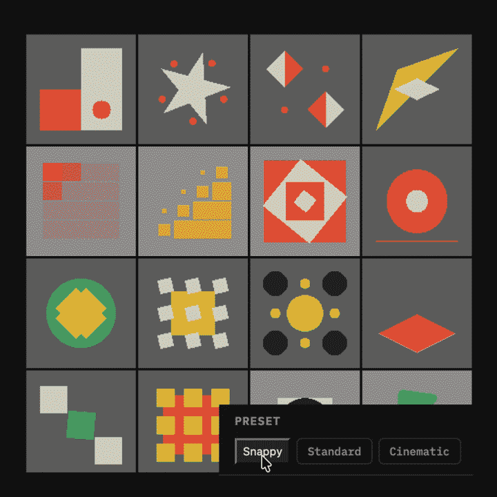
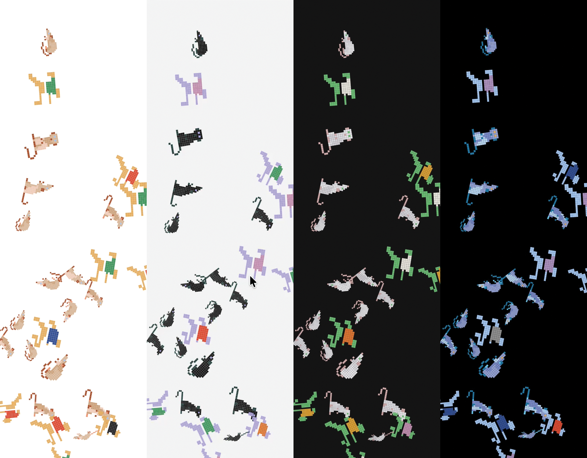

# Fields and Canvases

[Cadence: Case Study](index.md) · Chapter 3

---

## Motion Tiles: One Vocabulary at Scale

<figure style="margin: 0 0 16px 0;">
  
  <figcaption style="font-size: 12px; color: #909090; margin-top: 8px;">A preset change crossing the grid; the stagger carries it as a wave.</figcaption>
</figure>
The third tool answers the question the first two raise: what happens when a motion vocabulary has to cover a field instead of a button? Motion Tiles is a pooled mosaic (each cell deals its animation from a shared pool of sources) of over fifty Rive tiles sharing one clock. Change a preset and every tile recolors and retimes together. Drag the stagger and the change crosses the grid in a wave.

The presets are the same three personalities Token Lab carries, Snappy, Standard, Cinematic, spoken in a different dialect. A button press wants a duration and a bezier. An ambient field wants a period, an envelope, a spread. The two control suites stay separate on purpose: the user works one tool bar at a time, and the values were tuned to their contexts (a field that slows the way Cinematic slows a button would put the room to sleep). What the system shares across motion classes is the names; what it scopes per class is the interpretation. A vocabulary is only usable if you also decide where it ends.

The architecture is the argument made physical. The tiles carry no clocks of their own: one React `requestAnimationFrame` loop computes each tile's phase-offset progress from a weight table and writes it into that tile's Rive view model (the file's data-binding layer) every frame. Speed, easing, and stagger are consumed in React, not in the assets, which is exactly the token-to-behavior relationship from Token Lab operating on fifty canvases at once. The section is landing-gated so its WebGL2 grid loads only when entered, and the per-tile Rive bindings were built with Claude Code driving the Rive editor over MCP (Model Context Protocol, the bridge that lets a model operate another program's tools), a workflow the tool's own landing screen walks through.

## Embeds: Tokens Across the Canvas Boundary

Token Lab's component demos read tokens into Framer Motion props, which is the easy case: everything speaks CSS. The Embeds category runs the same tokens into canvases that have never heard of CSS, and the two demos split the ownership of time between them.

<!-- V09: live Rive Clock embed (?embed=rive-clock&theme=dark). Canvas only; a ghost pointer
     tours the quadrants and yields to a real pointer. Live on production (PR #2, 2026-08-15).
     David's fallback SVG sits behind the iframe as its background. -->
<figure style="float: right; width: 340px; max-width: 100%; margin: 0 0 16px 24px;">
  <iframe src="https://cadence.davidpreli.com/?embed=rive-clock&theme=dark" width="340" height="425" loading="lazy" title="Rive Clock, live from Cadence" style="border: 0; display: block; background: url(media/riveClockFallback.svg) center / contain no-repeat;"></iframe>
  <figcaption style="font-size: 12px; color: #909090; margin-top: 8px;">Live: the Rive Clock. The color plates chase a cursor on token timing; when nobody is there, a ghost takes the tour. Reach in and it yields. A click waters the plant.</figcaption>
</figure>
React Clock is a Rive animation triggered by a DOM button. The file holds poses; React holds time. Every animation in the `.riv` is a linear timeline scrubbed by a view-model number from 0 to 1, and a `requestAnimationFrame` driver integrates the live tokens into eased progress each frame: rain rides `duration.fast`, growth `duration.slower` on `ease.enter`, flowers arrive on `slow` and `standard` after `delay.long`. No duration, speed, or easing property exists inside the file at all, so a slider drag mid-growth bends the plant's pace on the very next frame. The Rive authoring and the React driver were built on opposite sides of a wall neither tool can see over, against a committed contract document naming every property, its type, and who writes it; when the two sides disagreed about what a number meant, the contract, not the code, was where the argument settled.

Rive Clock inverts the ownership. The animation is an interactive state machine that keeps its own clock (click it and it waters), rendered invisible; a WebGL shader stacked on top paints the pixelated copy the user actually sees, split into three color plates that chase the cursor. The tokens drive the chase: `duration.base` is the follow time constant, `duration.slow` the homecoming when the pointer leaves, `ease.standard` its curve, `delay.short` the per-plate stagger, `scale.pressExpressive` the aberration amplitude (how far the three plates split). Block size and gap stay spatial controls with no token behind them, because Token Fidelity keeps time-domain tokens on time-domain jobs. One demo where React owns the clock, one where the file does, and the same token set reaches into both.

## The Background: A Generative Field on the Token Clock

<figure style="margin: 0 0 16px 0;">
  
  <figcaption style="font-size: 12px; color: #909090; margin-top: 8px;">Two themes, one field. The placements hold still; only the paint changes.</figcaption>
</figure>
The nav column carries an ambient background: a field of small hand-authored animal marks placed by a generative composition, swaying on a slow two-sine wander, revealed as a section opens. Each of the three sections has its own mark library (hand-drawn for the Principles, pixel exports for Token Lab and Motion Tiles), and each library is authored in four colorways, one per theme, so the art is themed at the source instead of recolored at runtime.

Two architecture rules shape it. First, a theme switch must never regenerate the field: geometry and placement hold still while only the paint changes, and the shipped build was verified holding every placement byte-identical across a switch. Second, the unit of loading is one file: one library, chosen by the open section, in one colorway, chosen by the theme. Before that rule, all twelve colorway files shipped eagerly and the background chunk weighed 495.71 kB gzipped, two and a half times the entire app; after it, the landing page fetches 12.75 kB. The parity check that guards the twelve files against drifting apart moved out of the runtime and into the test suite, because the build should fail loud and not as an unnoticed console line.

The rendering is a stamp, not a stroke. An earlier renderer flattened every shape and redrew it with a 1.3px pen, which read as drawing on the hand-drawn marks and as mud on the pixel art; the shipped one places each authored mark in `<defs>` once and stamps it with a `<use>` per placement, no flattening, no outlining, no runtime color resolution. The argument for it is that the drawing comes out right.

And the tokens reach it, on the tokens' own terms. The idle drift's period scales with `duration.slower` under a clamp of 2.5 to 12 seconds: Snappy wanders at 2.8s, Standard at 4.8s (exactly the old fixed chrome constant), Cinematic at 11.2s, and Explore's extremes land on the clamp instead of a strobe. Loading a preset or resetting to defaults replays the reveal through a counter named `revealKey`; a slider drag never does. Named, deliberate acts reach the background, and noise does not.

---

[← The Principles](principles.md) · [Key Decisions →](key-decisions.md)
