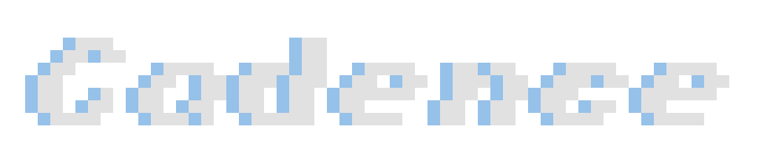
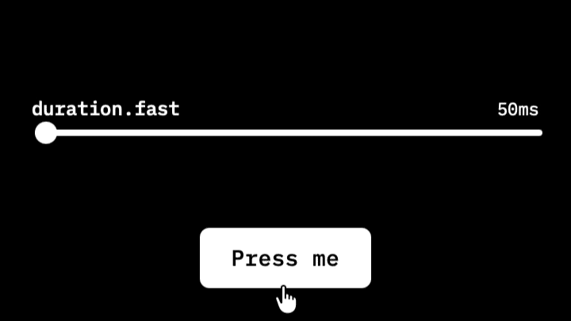

<h1></h1>

## Case Study

<!-- V01: the overview video, delivered 2026-08-05. Vimeo embed in a responsive 16:9 frame;
     Vimeo serves its own poster, so the OG-image placeholder retires. -->

  <iframe src="https://player.vimeo.com/video/1218553606?badge=0&amp;autopause=0&amp;player_id=0&amp;app_id=58479" title="Cadence: the case study overview" allow="autoplay; fullscreen; picture-in-picture; clipboard-write" allowfullscreen style="position: absolute; top: 0; left: 0; width: 100%; height: 100%; border: 0;"></iframe>

Cadence is a motion design system explorer. It demonstrates how design tokens drive animation behavior in real UI components, through the classic 12 principles of animation and six design-engineering extensions. Three tools share the vocabulary: Token Lab edits the tokens live, the Principles Library teaches them through eighteen cards, and Motion Tiles takes the named presets to field scale. It is built as a curriculum for designers learning how motion works at the system level.

**Role:** Design, architecture, development, documentation.
**Built with:** Claude. Planning in conversation, building in Claude Code; every line read and defended before it landed.
**Timeline:** Thirteen weeks to production. First commit April 18, 2026; live July 15, 2026, and still shipping. 285 commits as of August 15.
**Stack:** React, Framer Motion, CSS Custom Properties, Rive, Vite.
**Live:** [cadence.davidpreli.com](https://cadence.davidpreli.com)

<!-- V12: stat row. Values current as of 2026-08-15 (test and decision counts move; the commit
     count lives in the Timeline line above; refresh both on republish). -->

  

    
13

    
WEEKS TO PRODUCTION

  

  

    
39

    
CUSTOM COMPONENTS

  

  

    
578

    
TESTS

  

  <a href="key-decisions.html" style="text-decoration: none;">
    
39

    
DECISION RECORDS →

  </a>

---

## The Problem

Motion in design systems is underdocumented. A design system will specify every color to the hex digit and every spacing step to the pixel, then describe its motion in a paragraph: two duration values, an easing curve named "standard," and a sentence asking for restraint.

I spent eight years on the other side of that paragraph. A motion designer tunes timing in After Effects until it reads right, exports a spec, and hands it across a wall. What comes back rarely moves the way the spec did, and there is no shared surface where both sides can watch a value become a behavior. The relationship between a token and its perceptual result is invisible unless someone builds the thing that makes it visible.

<figure style="margin: 0 0 16px 0;">
  
  <figcaption style="font-size: 12px; color: #909090; margin-top: 8px;">The sentence below, running. The slider ramps 50 to 350; the presses are live.</figcaption>
</figure>
Cadence is that thing. Drag `duration.fast` from 50ms to 350ms and watch a button's press change character in the same second. The argument underneath: the freedom motion designers have in After Effects is not lost when motion enters a design system. It is organized, named, and made legible, and the organizing is a skill motion designers already have.

---

## Goals

1. Build a tool that makes the token-to-behavior relationship visible and interactive
2. Apply the classic 12 principles of animation, plus six design-engineering extensions, to real UI components, not abstract shapes
3. Develop React and design systems fluency through a project with genuine utility
4. Produce a portfolio artifact that demonstrates design engineering thinking

---

## The Chapters

1. **[The Token System](token-system.md):** five token families, the two-channel dispatch, and the bezier that spent three months claiming to be a spring
2. **[The Principles](principles.md):** eighteen cards, the classic twelve plus six extensions, each demonstrated on a real component, with build notes for all eighteen
3. **[Fields and Canvases](fields-and-canvases.md):** fifty tiles on one clock, tokens crossing into WebGL, and a generative background that listens to the presets
4. **[Key Decisions](key-decisions.md):** why `layoutId` left the codebase, why the grid took five tries, and the bug that existed only in production
5. **[What I Built, What I Learned](built-and-learned.md):** the shipped surface, the numbers, and what the build changed about the builder

---

## Going Deeper

Four companion documents, each a different cut of the same project:

- **[The Plain Overview](../cadence-overview.md):** what Cadence does, in plain language, no engineering required
- **[Two Lexicons](../cadence-two-lexicons.md):** the technical paper, organized as a translation table between motion design and design engineering
- **[Working with Claude](../working-with-claude.md):** how the collaboration ran, every line read before it landed, and which methods earned their keep
- **[What This Demonstrates](../cadence-what-this-demonstrates.md):** the direct version, for hiring managers

---

- **Live tool:** [cadence.davidpreli.com](https://cadence.davidpreli.com)
- **GitHub:** [github.com/StudioDavidPreli/cadence](https://github.com/StudioDavidPreli/cadence)
- **Portfolio:** [davidpreli.com](https://davidpreli.com)
