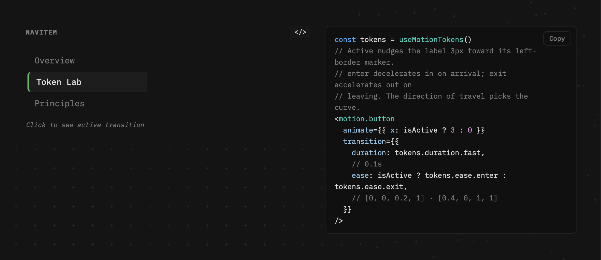
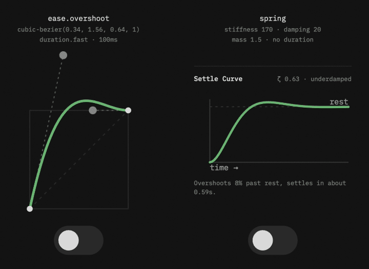

# The Token System

[Cadence: Case Study](index.md) · Chapter 1

---

## Token Architecture

<figure style="margin: 0 0 16px 0;">
  
  <figcaption style="font-size: 12px; color: #909090; margin-top: 8px;">The live code view. Values tick as sliders move; fixed references carry the (fixed) tag.</figcaption>
</figure>
Tokens are CSS custom properties in one file, `src/tokens/motion.css`. Five families: duration (fast 100ms, base 200ms, slow 400ms, slower 600ms), easing (five named cubic-bezier curves), delay (a named zero plus short, medium, long), scale (three press compressions below 1 and a lift above it, renamed `pressSubtle` / `pressBase` / `pressExpressive` / `lift` in July so direction lives in the name and no key implies a neutral it does not have), and spring (stiffness, damping, and mass, unitless, because a real spring is not measured in time). Components never hardcode an animation value; they read tokens at runtime through `getComputedStyle`. The custom-property layer is the one Material and Primer ship; the runtime read is Cadence's addition, and it is what keeps the demonstration authentic rather than simulated: Token Lab edits the same layer a production system would ship.

The set splits into editable tokens and fixed references. The durations, the four easing slots, the delays, the scales, and the spring parameters all have controls, and each control section carries a Constrained / Explore toggle: Constrained keeps the ranges a shipping UI would use, Explore opens the full range. The fourth easing slot, `ease.overshoot`, surfaces its control only in Explore, where the curve graph has the vertical room its above-one handle needs. Two tokens deliberately have no control at all: `ease.linear` is the constant-velocity baseline every curve is measured against, and `delay.none` is the system's named zero. The live code view tags these reads `(fixed)`, and a guard test asserts the two classes partition the full token set with nothing shared and nothing left over. One value stands outside the partition on purpose: the duration scalar, a single editable multiplier (effective duration = base × scalar) that drives the duration-versus-distance plot, handled outside the family machinery as a demonstrative multiplier.

Token sets export in four formats: W3C DTCG (`$type`/`$value`, the shape Style Dictionary and Figma Variables consume), flat JSON mirroring the CSS variable names, a drop-in CSS `:root` block, and a ready-to-use Framer Motion module (`cadence.motion.js`): named exports in seconds and four-number ease arrays, the spring as a native `{ type: 'spring' }` config, and composed transition examples, because the tool that teaches how tokens become motion should export the motion-side artifact, not only the token-side ones. All four serialize from one normalized object so they cannot drift. The spring family posed the one format question, because the DTCG draft has no spring type: it serializes as three `number` leaves under a `motion.spring` group, valid DTCG today with no invented type, and the group name carries the composition a custom type would have added. Import runs the pipeline in reverse with validation: scalars clamp to the Explore bounds and report, missing tokens fill from Standard and report, round-tripped curves re-canonicalize to their named keys, and the report modal lists every correction. One class of value refuses the clamp: a spring stiffness, damping, or mass at zero or below is a spring that never settles, so it fails the import as a structural error instead of being bent into something that looks valid and is not. A tuned token set leaves the tool as the artifact an engineer's pipeline consumes.

## The Hybrid Model: CSS Custom Properties + Framer Motion

<!-- V07: two-channel dispatch diagram. Inline SVG, dark theme baked (values from color.css dark). Labels are coupled to TokenLab/index.jsx names (dispatch, syncToCss, stateToTokens, MotionTokensProvider); if those rename, this diagram follows. Page should load IBM Plex Mono; falls back to system monospace. -->
<svg viewBox="0 0 880 440" role="img" aria-label="The two-channel dispatch: one slider edit updates the CSS custom property and the React context from the same reducer state" style="max-width: 880px; width: 100%; height: auto; font-family: 'IBM Plex Mono', ui-monospace, monospace;">
  <title>The two-channel dispatch</title>
  <defs>
    <marker id="v07-arrow" viewBox="0 0 8 8" refX="7" refY="4" markerWidth="7" markerHeight="7" orient="auto-start-reverse">
      <path d="M0.5 0.5 L7.5 4 L0.5 7.5 Z" fill="#76c17d" />
    </marker>
  </defs>

  <rect x="0.5" y="0.5" width="879" height="439" rx="12" fill="#141414" stroke="#2e2e2e" />

  <text x="40" y="48" font-size="11" font-weight="600" letter-spacing="1.5" fill="#aaaaaa">THE TWO-CHANNEL DISPATCH</text>

  <!-- The edit -->
  <rect x="30" y="174" width="170" height="56" rx="8" fill="#1a1a1a" stroke="#3d3d3d" />
  <text x="115" y="198" font-size="12" fill="#e1e1e1" text-anchor="middle">slider drag</text>
  <text x="115" y="216" font-size="10" fill="#909090" text-anchor="middle">SET_DURATION · fast · 140</text>

  <!-- dispatch -->
  <rect x="240" y="174" width="150" height="56" rx="8" fill="#1a1a1a" stroke="#3d3d3d" />
  <text x="315" y="206" font-size="12" fill="#e1e1e1" text-anchor="middle">dispatch(action)</text>

  <path d="M200 202 H232" stroke="#76c17d" stroke-width="1.5" fill="none" marker-end="url(#v07-arrow)" />

  <!-- Channel 1 · CSS -->
  <text x="450" y="76" font-size="10" font-weight="600" letter-spacing="1" fill="#909090">CHANNEL 1 · CSS</text>
  <rect x="450" y="88" width="170" height="60" rx="8" fill="#1a1a1a" stroke="#3d3d3d" />
  <text x="535" y="122" font-size="12" fill="#e1e1e1" text-anchor="middle">syncToCss(action)</text>
  <rect x="650" y="88" width="190" height="60" rx="8" fill="#1a1a1a" stroke="#3d3d3d" />
  <text x="745" y="112" font-size="11" fill="#e1e1e1" text-anchor="middle">--motion-duration-fast</text>
  <text x="745" y="130" font-size="10" fill="#909090" text-anchor="middle">written on :root</text>
  <text x="450" y="172" font-size="10" fill="#909090">anything reading the document sees the new value</text>

  <!-- Channel 2 · React state -->
  <text x="450" y="246" font-size="10" font-weight="600" letter-spacing="1" fill="#909090">CHANNEL 2 · REACT STATE</text>
  <rect x="450" y="258" width="170" height="60" rx="8" fill="#1a1a1a" stroke="#3d3d3d" />
  <text x="535" y="292" font-size="12" fill="#e1e1e1" text-anchor="middle">reducer state</text>
  <rect x="650" y="258" width="190" height="60" rx="8" fill="#1a1a1a" stroke="#3d3d3d" />
  <text x="745" y="282" font-size="11" fill="#e1e1e1" text-anchor="middle">stateToTokens(state)</text>
  <text x="745" y="300" font-size="10" fill="#909090" text-anchor="middle">→ MotionTokensProvider</text>
  <text x="450" y="342" font-size="10" fill="#909090">demo components take the same values with no CSS read at all</text>

  <!-- The split: one dispatch feeds both channels -->
  <path d="M390 202 H420 V118 H442" stroke="#76c17d" stroke-width="1.5" fill="none" marker-end="url(#v07-arrow)" />
  <path d="M390 202 H420 V288 H442" stroke="#76c17d" stroke-width="1.5" fill="none" marker-end="url(#v07-arrow)" />
  <path d="M620 118 H642" stroke="#76c17d" stroke-width="1.5" fill="none" marker-end="url(#v07-arrow)" />
  <path d="M620 288 H642" stroke="#76c17d" stroke-width="1.5" fill="none" marker-end="url(#v07-arrow)" />

  <!-- The claim -->
  <text x="40" y="394" font-size="13" fill="#e1e1e1">One dispatch, both channels, no divergence:</text>
  <text x="40" y="414" font-size="13" fill="#909090">the context object is derived from the same state that wrote the CSS.</text>
</svg>

CSS owns the values; Framer Motion executes the motion. The trick is keeping both honest while a slider is being dragged.

Token Lab runs a two-channel update. Every change writes the CSS custom property, so anything reading the document root sees the new value. Simultaneously, a React context provider hands the same values directly to components inside the demo area, bypassing the CSS read entirely, so a drag retimes the demos on the same frame instead of waiting for a re-read. Components outside the provider fall back to the CSS channel. One dispatch, both channels, no divergence: the context object is derived from the same state that wrote the CSS.

The system also draws a line the demonstration depends on. Demonstration motion, the thing a principle teaches, reads the editable `--motion-*` tokens, because the point is that editing a token changes it. The tool's own chrome (hover states, the nav crossfade, accordions) reads fixed `--feedback-*` constants instead, so dragging a duration to near zero in Explore mode can never collapse the interface's own feedback into nothing. A build-gating test enforces the whole arrangement: an undocumented inline animation literal in a component fails the suite, and the one literal on its allow list is Token Fidelity's deviant pill, hardcoded because that principle teaches what hardcoding does. The claim "no hardcoded animation values" is not a convention here; it is a test that fails.

<!-- V13: spring glyph inlined from public/titleSVGS/spring.svg, ink set to heading color (the source file is black-on-transparent). -->
<h2 style="display: flex; align-items: center; gap: 12px;"><svg viewBox="0 0 79.34 47.16" width="40" height="24" aria-hidden="true" style="flex: none;"><path fill="#e1e1e1" d="M30.57,41.02c-3.83-7.07-1.6-20.87,2.16-28.4-.81-1.22-1.89-2.26-3.21-3-2.64-1.49-6.04.56-7.93,3.09,3.26,5.56,4.77,12.59,4.37,18.94-.25,3.98-1.64,8.59-5.5,9.7-2.7.78-5.31-.38-6.56-2.89-3.38-6.79-.59-19.06,3.43-25.68-2.5-2.94-6.73-1.62-9.21,1.01-3.22,3.43-4.39,8.76-4.78,13.44-.08.99-.91,1.63-1.78,1.57S-.07,27.96,0,26.95c.4-5.68,2.13-12.28,6.33-16.14,3.59-3.31,9.29-4.52,13.03-.79,1.66-1.82,3.58-3.31,5.96-3.97,3.73-1.04,6.65.53,9.26,3.42,1.94-2.97,4.41-5.25,7.57-6.6,4.4-1.87,9.16-1.02,12.65,2.38,3.52-4.5,8.77-6.63,14.06-4.31,4.84,2.56,7.15,8.75,8.4,14.01,1.4,5.9,1.97,11.84,2.07,17.92.02,1.01-.84,1.7-1.69,1.7-.91,0-1.65-.69-1.67-1.7-.13-5.84-.65-11.54-2-17.21-1.02-4.28-3.18-10.51-7.27-11.95-3.65-1.28-7.31.87-9.56,3.98,5.22,6.96,7.66,16.97,7.66,25.56,0,5.83-1.77,13.7-7.96,13.89-4.28.13-6.84-3.45-8.02-7.54-2.7-9.34-.81-22.82,4.04-31.55-2.67-2.99-6.79-3.66-10.34-1.65-2.47,1.41-4.37,3.55-5.78,6.02,4.23,7.28,7.55,20.78,3.8,27.99-1.29,2.48-3.84,3.94-6.59,3.36-1.5-.32-2.65-1.42-3.39-2.77ZM59.14,42.5c.81-1.07,1.34-2.33,1.63-3.6,1.92-8.31-.61-20.87-5.56-28.09-3.42,6.79-4.56,14.84-4.15,22.19.33,3.37.93,7.57,3.24,9.84,1.4,1.38,3.59,1.32,4.84-.34ZM20.96,37.18c.88-1.46,1.39-2.98,1.56-4.7.57-5.64-.45-11.35-3-16.63-2.57,4.97-3.71,10.25-3.75,15.65.1,1.84.33,3.5.94,5.15.48.84,1.09,1.53,1.93,1.58s1.61-.35,2.31-1.04ZM34.72,40.48c3.05.71,4.13-4.5,4.06-7.81-.1-5.7-1.37-11.21-3.9-16.54-2.7,6.71-4.1,15.93-1.7,22.66.34.6.81,1.52,1.53,1.69Z" /></svg>The Spring That Is Not a Curve</h2>

For the first three months the token set carried an easing curve named `spring`: `(0.34, 1.56, 0.64, 1)`, a cubic-bezier whose control point climbs past 1 and comes back down. It gives the look of a spring on a fixed timeline. A true spring has no duration; you give it stiffness, damping, and mass, and the settle time falls out of those three. The July harmonization pass renamed the bezier to `overshoot`: the name now describes what the curve does, not what it imitates.

The rename freed the name for the real thing. Three unitless custom properties join the token layer, read at runtime like every other token, and Framer Motion consumes them as `{ type: 'spring', stiffness, damping, mass }` instead of a duration plus a curve. Each preset bakes its own spring personality: Snappy is stiff and bounces hard, Cinematic damps the bounce nearly out and arrives composed, Standard settles with a hint of ring. Material 3 Expressive moved its expressive motion to physics springs in 2025; Cadence follows without breaking its own read-at-runtime rule, because unitless numbers get along in CSS custom properties.

<figure style="margin: 0 0 16px 0;">
  
  <figcaption style="font-size: 12px; color: #909090; margin-top: 8px;">The imitation and the physics on one state. Each toggle carries its curve above it; the spring has no duration anywhere.</figcaption>
</figure>
The tool surface makes the difference visible. The Spring section carries three sliders and a settle-curve visualizer: a plot of displacement over time, rising, overshooting the target, settling, redrawn as the sliders move. The math underneath is the damped harmonic oscillator, the same second-order system Framer Motion integrates, kept in a pure module so the three regimes (underdamped rings, critical arrives clean, overdamped crawls) test without React. Switch a Button to Spring, drag stiffness, and the button, the chart, and the dedicated SpringDemo move together off one context.

One gap surfaced on the way and closed. Reduced-motion support here works by flattening durations to near zero, and a spring has no duration to flatten, so the preference slid right past it. The flattened token set now carries a flag the spring consumers read, falling back to the bezier branch whose timing is already collapsed. The principle demo that forced the fix is Follow Through, the first reduced-motion-respecting surface to run the real spring.

---

**Companion:** [Two Lexicons](../cadence-two-lexicons.md), the same engineering organized as a translation table between motion design and design engineering.

[← Case Study](index.md) · [The Principles →](principles.md)
